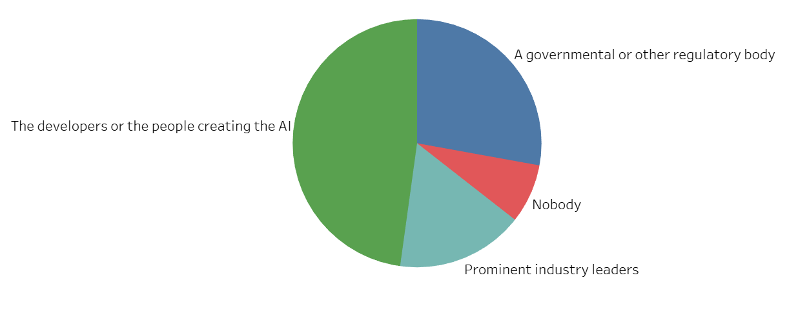
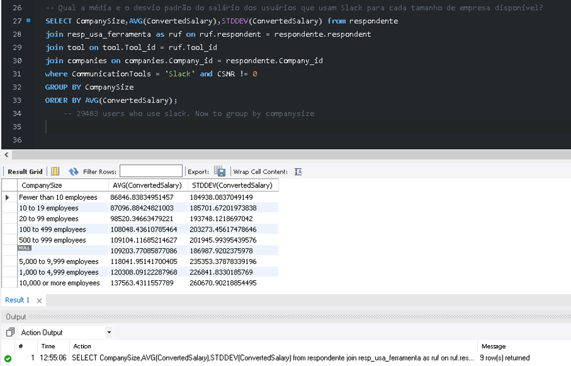
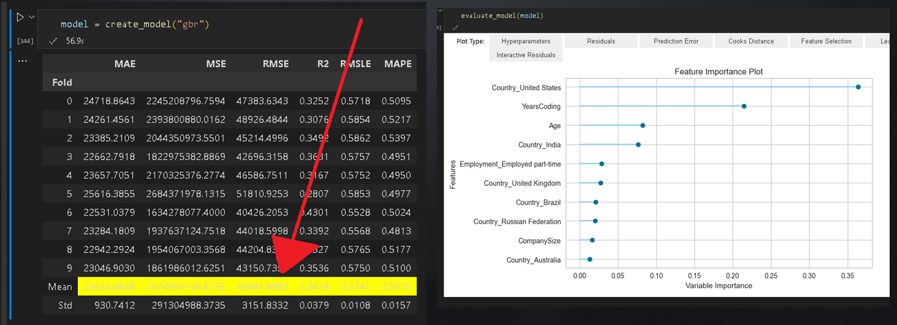
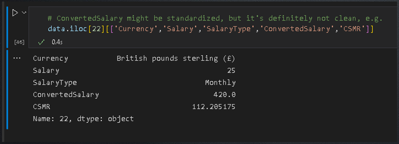
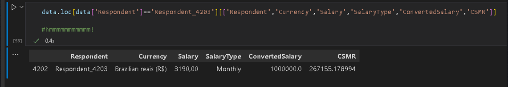

# Ironhack Final Project: Case AME-Digital

Project status: Completed

# Project objective

This data viz project comes from the fintech AME-Digital's case for Data Engineers.
The case itself is based on the Stack Overflow 2018 Developer Survey (available on Kaggle: https://www.kaggle.com/datasets/stackoverflow/stack-overflow-2018-developer-survey).
Nearly 100,000 developers took the 30-minute survey in January 2018, answering a total of 129 questions ranging from basic info (gender, age, job title, annual salary estimate) to subjective opinions regarding ethics in coding and responsability towards AI creations.

The case sets specific goals: answering questions regarding average salary of respondents, where they are from, what technologies and communication tools they use etc.

This final project, however, aimed to go beyond the case itself. Since the focus is on salary data, I've implemented a predictive model that gives a salary estimate based on a number of factors: how long one has worked with programming, what is the size of the company one's currently working in, what country one's working in etc.

This predictive model lead to interesting conclusions about the case itself, which I will detail further below.

# Technologies

Python

MySQL

SQLAlchemy

Pandas

Sklearn

Tableau

# Project Description

The case itself is heavily focused on SQL queries. It is divided into 2 portions:

1) Populating a data bank from the raw survey data.

2) Performing SQL queries to answer the given questions.

My final project aimed to focus on data viz, thus after answering the case's questions my goal was to generate insights from respondents' salary data.

# Steps

## Data Inspection and cleaning

Of a total of 98,855 respondents, 67,441 (68.2%) fully completed the survey. Their answers are available in the csv file "survey_results_public.csv" and were transported into a
Pandas DataFrame for inspection. As the snapshot below shows, most of the data was previously curated.

Cleaning was therefore limited to reindexing, converting NaNs to 0.0 for salaries and converting Yes/No questions to 1's and 0's, as requested on the case description.
This proved useful later when building the predictive model due to a faster processing of numerical rather than categorical variables.
Some questions e.g. "LanguageWorkedWith" which involved multiple inputs required processing for isolating multiple answers with split and explode methods.

Care should be taken when using this sort of data as a proxy for the state of Information Technology around the world. As we will show, the vast majority of respondents are men from the United States. Although several other countries are present
in this survey, some are artificially excluded by a matter of language barriers: users from China, South Korea and Japan, for example, are massively underrepresented in this survey.

Some of the most precious variables from this dataset are undoubtedly the ones concerning salaries. The Stack Overflow survey included an extra variable "Converted Salary" which
normalizes all the inputs to a single format: yearly salary in US$. This is exceptional considering that input by respondents came in myriad formats regarding currencies
and salary types (e.g. yearly, monthly or weekly). These were all done for the current exchange rates from January 2018.

## Insights from salary data:

    

A simple scatter plot of normalized salary entries yields a gamma distribution with some expected results:
Out of 47,702 entries, about 80% of entries are up to 100k US$/year. This rises to  over 93% when up to 200k US$/year i.e. only a minority of respondents have "astronomical" salaries.
Highlighted in the plot are two conspicuous features: outliers for salaries exactly at 1 million and 2 million US$/year. These suggest that some respondents rounded their revenue for convenience.

If we filter a range of people earning at least a minimum wage (for Brazilian standards in 2018, roughly 3,000 US$/year) up to 500,000 US$/year (rich, but not astronomically so),
the distribution becomes roughly logarithmic.

Hidden beneath this plot, however, are discrepancies that arise from the respondent profile: their gender, for example, betray a salary gap *dependent* on their nationality, as we will see below in detail.

A number of other factors play a role here, ranging from the years of experience that an employee has with coding to the size of the company in which they are employed.

  

### Nationality and Gender

Stack Overflow users from the United States dominate the survey, followed by countries from the G7 and BRICS groups (China being the biggest exception due to the language barrier discussed in the beginning).

    

On all of these countries, gender displays a persistent pattern: on average, less than 10% of respondents are female.

    

The distribution of salaries is heavily dependent on nationality, as we can see below. Rich countries like the US and England display normal distributions (as Kolmogorov-Smirnov tests quickly shows us), although the average salary shifts almost by 50% between the 2 curves.
The US by far concentrates the number of rich and "astronomically" rich respondents, but there are no discrepancies or excessive kurtosis in either side.

    

Germany is an interesting case, shown below, as the distribution is actually bimodal. A fellow data analyst from Germany believes that this could have a sociological explanation as part of a recent migration flux (mostly from Turkey) is absorbed into less regulated (and less paying) jobs in IT companies.

    

India (red in the first graph) shows yet another pattern, more logarithmic than normal, with a massive number of low-paying jobs. Brazil finds itself roughly between the pattern shown in India and those of 1st-world countries.
As the IT field expands in Brazil, it is expected that the distribution will shift to the right, becoming more normal as well.

A number of other inferences can be shown when plotting salary against other variables. Some are unsurprising (there is a linear correlation between age and better salaries. Bigger companies usually correlate with better paying jobs etc).
Some are interesting, perhaps, as didactic exercise: as shown in the graph below, people with better salaries tend to exercise more. The question is: do they exercise more *because* they have better salaries (improving quality of live) or could there be a relationship between productivity and those who are more active?

    

At this point many a frustrated statistician could feel inclined to shout at the screen the maxim that "correlation does not imply causation!", and we will move on to more objective (or, rather, *less* *subjective*) insights.

I should, however, point to the fact that there are myriad interesting conclusions that come from simply tallying the answers to categorical, opinion-based questions. Against the unspoken rules of data viz, some even benefit from being displayed on the outcast of plots, the poor pie graph:

    

When answering the question "Whose responsibility is it, **primarily**, to consider the ramifications of increasingly advanced AI technology?", almost half perceive this responsibility to fall in the lap of the developers themselves, followed by those who believe that either the government or Elon Musks should take the reins of the situation. Almost 10%, however, steer towards full AI anarchy.

Finally, on the subject of the salary gender gap, the following graph shows that the gap, albeit prevalent almost everywhere, varies from country to country. Please observe that the x-axis scale is logarithmic, thus the gap is deceivingly larger than visually represented. The gap is more prevalent in countries such as Russia, Australia and India. Others, such as Brazil, display more gender equality *but* we should also note that outliers i.e. the rich and astronomically rich are always more prevalent for men than women. To conclude, we must not forget that women are severely underrepresented in this survey, so inferences from the outliers alone should be taken with a grain of salt.

    

After these inspections were done, it was finally time to construct the databank and target the questions from the case itself. I thank the creators of SQLAlchemy for this amazing tool which severely speeds up the process of data ingestion, especially when transporting it from previous Pandas DataFrames.

## Populating the data bank.

The data bank structure is provided in the case documentation and can be seen in the figure below:

    

Queries were made directly in MySQL workbench after ingestion, as seen in this example:

    

Below are the questions and their respective answers for the AME-Digital case.

-- What is the quantatity of respondents by country?

SELECT Country, COUNT(*) from respondente
JOIN country on country.Country_id = respondente.Country_id
GROUP BY Country
ORDER BY COUNT(*) DESC;

-- How many users from the US prefer Windows OS?

SELECT * from respondente
JOIN country on country.Country_id = respondente.Country_id
JOIN os on os.OS_id = respondente.OS_id
WHERE Country = 'United States' and OperatingSystem = 'Windows';
	-- returns 7635 users

-- What is the salary average for users from Israel who prefer Linux?

SELECT AVG(ConvertedSalary) from respondente
JOIN country on country.Country_id = respondente.Country_id
JOIN os on os.OS_id = respondente.OS_id
WHERE Country = 'Israel' and OperatingSystem = 'Linux-based'  and CSMR != 0;
	-- returns 178 users in total, but only 93 with actual salary input. CSMR mean yields 43487.84135304659 monthly reais
    -- 'CSMR' stands for ConvertedSalaryMonthlyReais
    -- 'ConvertedSalary' is yearly in USD

-- What is the mean and standard deviation for users' salaries who use Slack, for each available size of companies?

SELECT CompanySize,AVG(ConvertedSalary),STDDEV(ConvertedSalary) from respondente
join resp_usa_ferramenta as ruf on ruf.respondent = respondente.respondent
join tool on tool.Tool_id = ruf.Tool_id
join companies on companies.Company_id = respondente.Company_id
where CommunicationTools = 'Slack' and CSMR != 0
GROUP BY CompanySize
ORDER BY AVG(ConvertedSalary);
	-- 29483 users who use slack. Now to group by companysize

-- What is the diference in salary mean for Brazilian respondents who code as a hobby and those for all Brazilian respondents, grouped by OS?

SELECT OperatingSystem,AVG(ConvertedSalary) as media_hobby from respondente
JOIN country on country.Country_id = respondente.Country_id
JOIN os on os.OS_id = respondente.OS_id
where Country = 'Brazil' and Hobby = 1
GROUP BY OperatingSystem;

SELECT OperatingSystem,AVG(ConvertedSalary) as media_geral from respondente
JOIN country on country.Country_id = respondente.Country_id
JOIN os on os.OS_id = respondente.OS_id
where Country = 'Brazil'
GROUP BY OperatingSystem;

-- What are the top 3 technologies more frequently used by developers?

SELECT CommunicationTools,COUNT(CommunicationTools) from respondente
join resp_usa_ferramenta as ruf on ruf.respondent = respondente.respondent
join tool on tool.Tool_id = ruf.Tool_id
join companies on companies.Company_id = respondente.Company_id
GROUP BY CommunicationTools
ORDER BY Count(CommunicationTools) DESC
LIMIT 3;
	-- Slack, Jira, Office

-- What are the top 5 countries in terms of salary?

SELECT Country, AVG(ConvertedSalary) from respondente
JOIN country on country.Country_id = respondente.Country_id
where ConvertedSalary != 0
GROUP BY Country
ORDER BY AVG(ConvertedSalary) DESC;

# Modelling

blablabla

    

blablabla

    

blablabla

    

blablabla

    

# Conclusion

blablabla

    

